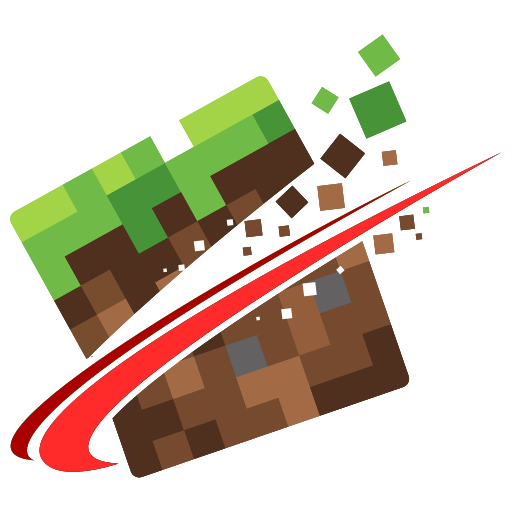

<!--suppress HtmlDeprecatedAttribute -->
<div align="right">
  <a href="https://github.com/xiaofanforfabric/headlessmc">中文</a> | English
</div>

<h1 align="center" style="font-weight: normal;"><b>HeadlessMc</b></h1>
<p align="center">A command line launcher for Minecraft Java Edition.</p>
<p align="center"></p>
<p align="center"><a href="https://github.com/headlesshq/mc-runtime-test">Mc-Runtime-Test</a> | HMC | <a href="https://github.com/headlesshq/hmc-specifics">HMC-Specifics</a> | <a href="https://github.com/headlesshq/hmc-optimizations">HMC-Optimizations</a></p>

<div align="center">

[](https://app.codacy.com/gh/headlesshq/headlessmc/dashboard?utm_source=gh&utm_medium=referral&utm_content=&utm_campaign=Badge_grade)
[](https://github.com/headlesshq/HeadlessMc/releases)


[](https://hub.docker.com/r/3arthqu4ke/headlessmc/)


</div>

> [!WARNING]
> NOT AN OFFICIAL MINECRAFT PRODUCT. NOT APPROVED BY OR ASSOCIATED WITH MOJANG OR MICROSOFT.
>
> HeadlessMc will not allow you to play without having bought Minecraft!
> Accounts will always be validated.
> Offline accounts can only be used to run the game headlessly in CI/CD pipelines.

HeadlessMc is a feature rich launcher for Minecraft Java Edition that runs in your terminal.
It can run the Minecraft client in headless mode, e.g. enabling you to run it on CI/CD runners.
What's more, it handles various mod loaders, modpacks, mods, resourcepacks, shaderpacks, datapacks...
Even servers can be managed using HeadlessMc.

Download the latest release and visit our [Getting Started](https://headlesshq.github.io/headlessmc/getting-started/)
page to get started, it's as easy as:
```shell
> headlessmc login
> headlessmc launch fabric 26.3
```
